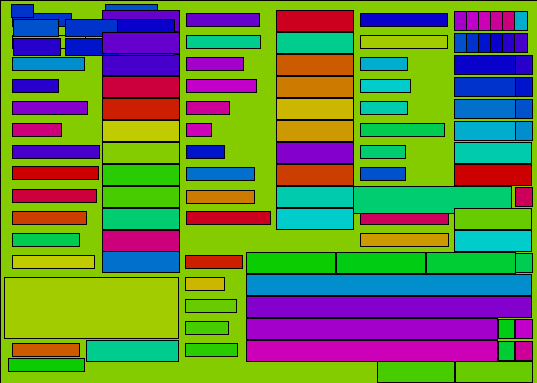
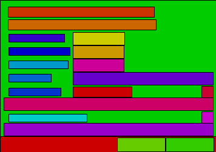
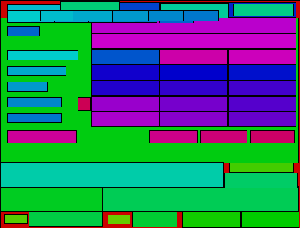

# DFM Render

A tool to quickly visualise the layout of Borland DFM layout files

## Usage

```
./dfm-render.py <input DFM file> <output PNG file>
```

## Example Output



Source: https://github.com/tomojitakasu/RTKLIB/blob/master/app/rtkplot/plotopt.dfm



Source: https://github.com/tomojitakasu/RTKLIB/blob/master/app/rtkget/getoptdlg.dfm



Source: https://github.com/tomojitakasu/RTKLIB/blob/master/app/rtkconv/convopt.dfm
